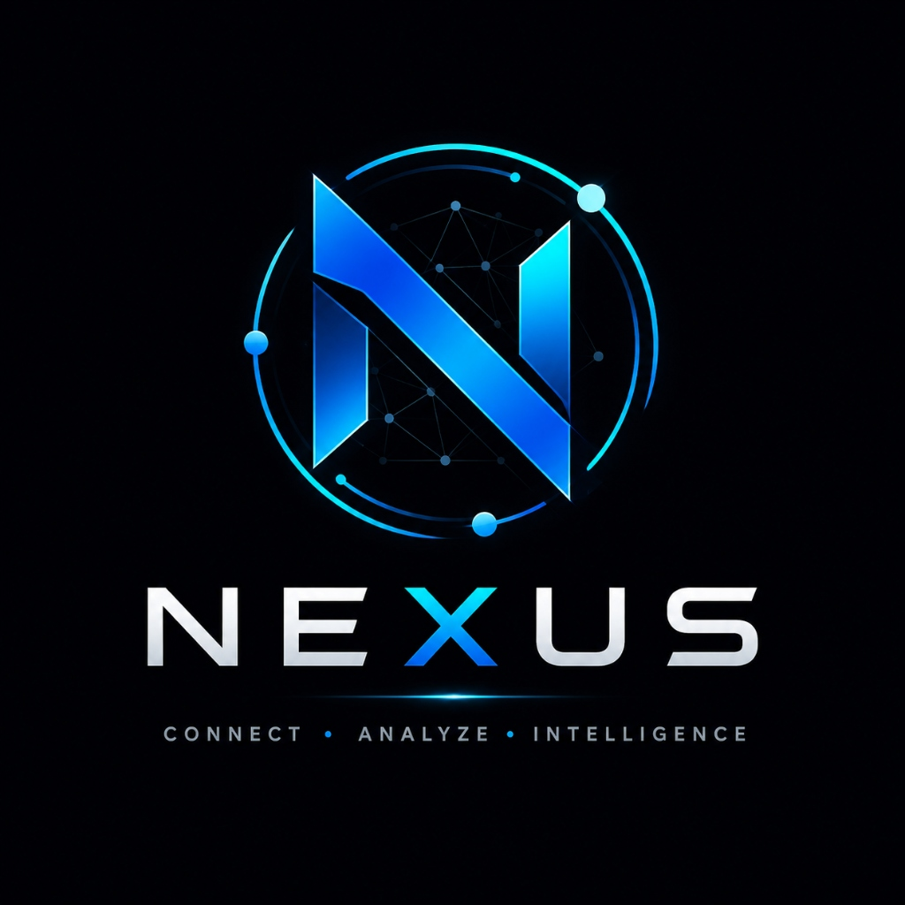
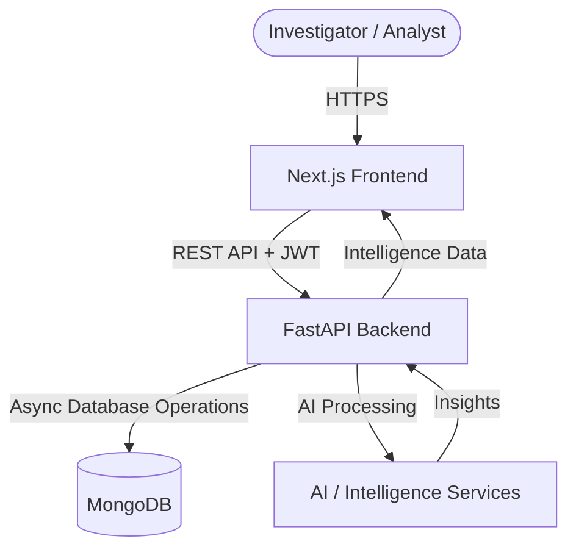
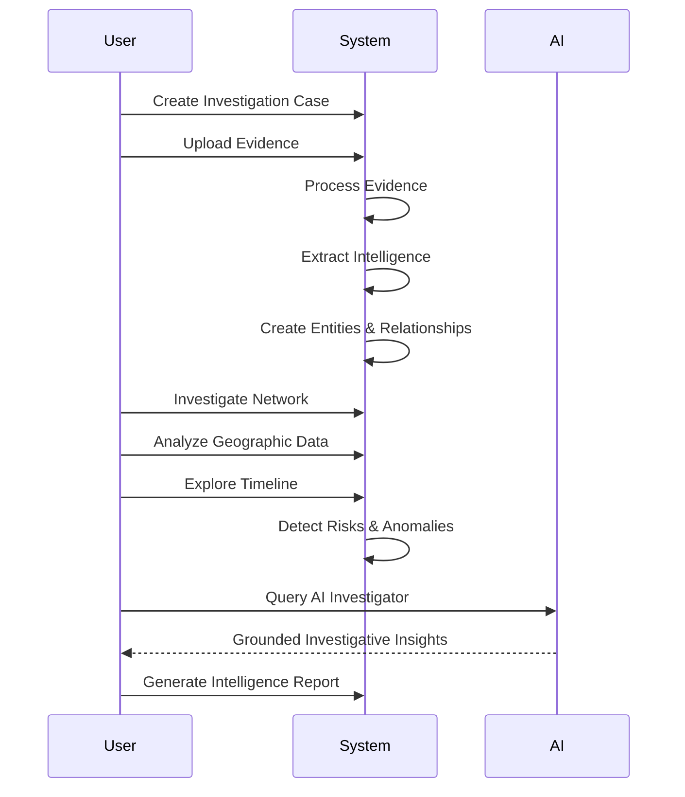

<div align="center">
  

# NEXUS

### AI-Powered Intelligence & Investigation Platform

<p><em>Connect data. Discover relationships. Investigate intelligently.</em></p>

<p>
  
  
  
  
  
  
</p>


</div>

<br />

## 🌟 What is NEXUS?

NEXUS is an advanced intelligence and investigation platform designed to help investigators, analysts, and security professionals transform complex data into actionable intelligence.

With powerful visualization, AI-assisted analysis, and evidence processing capabilities, NEXUS helps users:

- **Investigate complex relationships** across large datasets.
- **Analyze entity networks** to uncover hidden actors and influential connections.
- **Process evidence** and extract actionable intelligence.
- **Detect anomalies** and abnormal behavioral patterns.
- **Identify potential risks** using intelligent analysis.
- **Explore geographic intelligence** and spatial relationships across cases.
- **Reconstruct timelines** to understand chronological patterns.
- **Generate intelligence reports** that are structured, clear, and actionable.
- **Use AI-assisted investigation** to ask natural language questions and extract grounded insights from case data.

<br />

<div align="center">


<p><code>DATA ➔ ENTITIES ➔ RELATIONSHIPS ➔ ANALYSIS ➔ INTELLIGENCE</code></p>

</div>

---

## 🚀 Key Capabilities

| Capability | Description |
|------------|-------------|
| 🤖 **AI Investigation** | Ask questions about case data and uncover relationships using AI-assisted analysis. |
| 🕸 **Network Intelligence** | Explore entity relationships and connection patterns through interactive network visualizations. |
| 🌍 **Geographic Intelligence** | Analyze location-based intelligence, movement patterns, and geographic relationships. |
| ⏱ **Timeline Analysis** | Reconstruct events and investigate chronological patterns to identify gaps and critical moments. |
| 📁 **Evidence Intelligence** | Upload, process, organize, and extract intelligence from investigation evidence. |
| ⚠️ **Risk Detection** | Identify high-risk entities, suspicious activity, and potential emerging threats. |
| 📊 **Anomaly Detection** | Detect unusual patterns, abnormal behavior, and hidden investigation signals. |
| 📄 **Intelligence Reports** | Generate structured intelligence reports and actionable summaries automatically. |

---

## 🖥 Platform Preview

> *High-resolution screenshots and product walkthroughs can be added below.*

### 🧠 Intelligence Dashboard

A centralized command center providing an overview of active cases, recent intelligence alerts, investigation activity, and system status.

> 📷 `docs/images/dashboard.png`

---

### 🕸 Network Investigation

Interactive node-based visualizations that allow analysts to explore entity relationships and uncover complex networks.

> 📷 `docs/images/network-graph.png`

---

### 🤖 AI Investigator

A conversational AI assistant that queries case data and provides grounded, contextual insights directly from available evidence.

> 📷 `docs/images/ai-investigator.png`

---

### 🌍 Geographic Intelligence

A map-based investigation interface for tracking entities, analyzing locations, and cross-referencing geographic intelligence.

> 📷 `docs/images/geographic-intelligence.png`

---

### ⏱ Timeline Analysis

A chronological visualization system for reconstructing event sequences and identifying important gaps or patterns.

> 📷 `docs/images/timeline.png`

---

### 📁 Evidence Intelligence

A centralized evidence workspace that transforms raw uploads into organized, searchable intelligence artifacts.

> 📷 `docs/images/evidence-intelligence.png`

---

## ⚙️ System Architecture

NEXUS uses a modern architecture designed to handle complex intelligence data, relationships, and investigation workflows.



### Architecture Components

- **Frontend** — A responsive interface built with React, Next.js, Tailwind CSS, and Framer Motion.
- **Backend** — A high-performance Python backend powered by FastAPI for API routing, validation, and intelligence processing.
- **Database** — MongoDB provides flexible document storage for intelligence entities, relationships, cases, and evidence.
- **Authentication** — JWT-based authentication ensures secure and stateless user sessions.
- **Intelligence Services** — Integration with AI models for natural language processing and conversational investigation.
- **Visualization Components** — Interactive visualizations using React Three Fiber, MapLibre GL, and network graph technologies.

---

## 🛠 Technology Stack

| Layer | Technologies |
|------|-------------|
| **Frontend** | Next.js, React, Tailwind CSS, Framer Motion, TypeScript |
| **Backend** | Python, FastAPI, Pydantic, Uvicorn |
| **Database** | MongoDB, Motor |
| **Authentication** | JWT, bcrypt |
| **Visualization** | React Three Fiber, MapLibre GL, Force-directed Graphs |
| **AI Integration** | LiteLLM, HuggingFace APIs, Transformers |

---

## 🔄 Core Investigation Workflow



---

## 🔐 Security Features

NEXUS prioritizes secure data handling and strict authorization at the backend boundary.

- **JWT Authentication** — Secure, stateless session management.
- **Case-Level Authorization** — Users can only access data and evidence belonging to their authorized investigations.
- **Object-Level Access Protection** — Backend validation prevents arbitrary IDs from bypassing authorization.
- **File Type Validation** — Only supported investigation file formats are accepted during uploads.
- **Secure UUID Naming** — Uploaded files and entities use secure identifiers.
- **Path Traversal Protection** — Prevents malicious attempts to access restricted file directories.
- **User-Scoped Data Access** — Intelligence data is isolated according to authenticated users and their investigations.

---

## ⚡ Performance & Reliability

- **Active Case Persistence** — Investigation state can be managed and restored across sessions.
- **Case Isolation** — Data queries are scoped to individual investigations.
- **Error Boundaries** — Frontend components handle failures gracefully.
- **Graceful API Failure Handling** — Backend provides clean responses for processing or AI service failures.
- **Responsive Layouts** — Optimized for desktop and tablet investigation environments.
- **Light & Dark Mode** — Supports multiple viewing environments for improved usability.

---

## 📦 Installation & Setup

### Prerequisites

Make sure the following are installed:

- **Node.js** v18+
- **Python** v3.9+
- **MongoDB** (Local installation or MongoDB Atlas)

---

### 1. Clone the Repository

```bash
git clone https://github.com/ASTA91-GIT/Nexus.git
cd Nexus
```

---

### 2. Frontend Setup

```bash
cd frontend
npm install
npm run dev
```

The frontend will be available at:

```text
http://localhost:3000
```

---

### 3. Backend Setup

Open another terminal and run:

```bash
cd backend
python -m venv venv
```

Activate the virtual environment.

**Windows:**

```bash
venv\Scripts\activate
```

**Linux / macOS:**

```bash
source venv/bin/activate
```

Install dependencies:

```bash
pip install -r requirements.txt
```

---

### 4. Environment Configuration

Create a `.env` file inside the `backend/` directory.

```env
# Database
MONGODB_URI=mongodb://localhost:27017
DATABASE_NAME=nexus

# Security
JWT_SECRET=your_super_secret_key_change_in_production

# AI Integration
HUGGINGFACE_API_KEY=your_huggingface_key_here

# Frontend
FRONTEND_URL=http://localhost:3000
```

---

### 5. Run the Backend Server

```bash
uvicorn app.main:app --reload
```

The backend API will run on:

```text
http://localhost:8000
```

---

## 🧪 Testing & Verification

### Frontend Build Verification

```bash
cd frontend
npm run build
```

### Backend Validation

```bash
cd backend
python check_db.py
```

> Run additional linting or validation commands if they are configured in the project.

---

## 📂 Project Structure

```text
NEXUS/
│
├── frontend/
│   ├── src/
│   │   ├── app/           # Next.js App Router
│   │   ├── components/    # Reusable UI & Visualization Components
│   │   ├── context/       # Application Context
│   │   ├── lib/           # Utilities and Motion Variants
│   │   └── content/       # Static Landing Content
│   │
│   └── public/            # Static Assets
│
├── backend/
│   ├── app/
│   │   ├── api/           # FastAPI Route Handlers
│   │   ├── core/          # Database, Config & Security
│   │   ├── models/        # Pydantic Models & Schemas
│   │   └── services/      # Business Logic & AI Processing
│   │
│   └── requirements.txt
│
├── docs/
│   └── images/            # Documentation Screenshots
│
└── README.md
```

---

## 🗺 Roadmap

- [ ] Advanced role-based collaboration
- [ ] Real-time investigation collaboration
- [ ] Expanded AI intelligence models
- [ ] Local LLM support
- [ ] Investigation export improvements
- [ ] Advanced anomaly detection models
- [ ] Performance optimization for extremely large graphs
- [ ] Advanced notification and alert system
- [ ] Production deployment configuration

---

## 🎥 Demo

A full interactive demonstration and visual walkthrough will be added here.

Future additions may include:

- 🎬 Product walkthrough videos
- 🔄 Investigation workflow GIFs
- 🕸 Interactive network demonstrations
- 🤖 AI Investigator examples
- 🌍 Geographic intelligence walkthroughs

<!-- Example:

-->

---

## 🤝 Contributing

Contributions are welcome.

1. Fork the repository.
2. Create a feature branch.

```bash
git checkout -b feature/amazing-feature
```

3. Make your changes.
4. Test the frontend and backend.
5. Commit your changes.
6. Submit a Pull Request.

---

<div align="center">

<br/>

### Built for intelligent investigations.

**NEXUS — Connect data. Discover relationships. Investigate intelligently.**

<br/>

</div>
