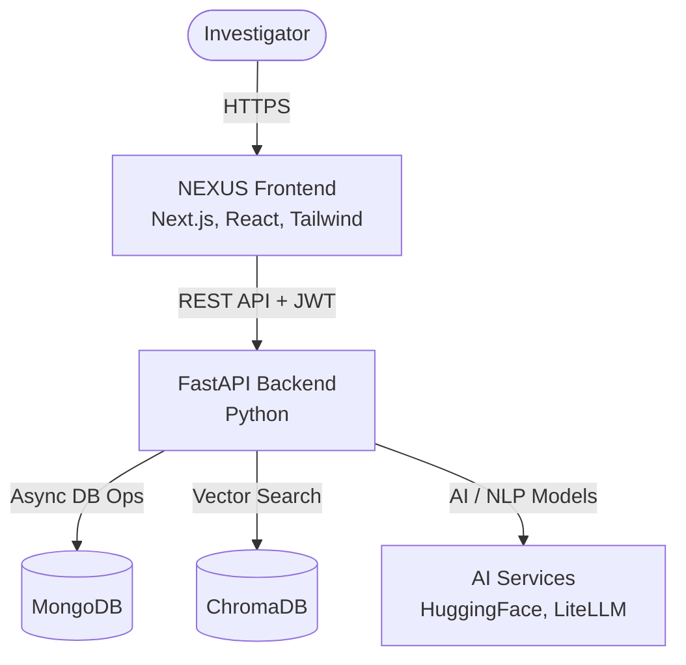

<div align="center">

# NEXUS
## AI-Powered Criminal Network Analysis System
**Smart India Hackathon 2026**
**Team: Quantum Coders**

</div>

NEXUS is an intelligent investigation platform designed to help investigators analyze complex criminal networks by bringing fragmented case data, entities, relationships, evidence, geographic information, timelines, risk indicators, and AI-assisted investigation into one unified platform.

By converging disparate data streams into a single pane of glass, NEXUS empowers law enforcement and intelligence analysts to uncover hidden actors, trace illicit financial flows, and detect abnormal behavioral patterns. Connect the data. Understand the network. Accelerate the investigation.

Instead of manually cross-referencing spreadsheets and disconnected databases, investigators can leverage NEXUS's interactive network graphs, chronological event timelines, geographic intelligence, and conversational AI investigator to quickly identify investigative leads and transform raw evidence into actionable intelligence.

## Smart India Hackathon 2026

| Field | Details |
|---|---|
| Problem Statement ID | SIH26189 |
| Problem Statement | AI-Powered Criminal Network Analysis System |
| Ministry | Ministry of Home Affairs |
| Division | NCRB Women Safety Division |
| Category | Software |
| Theme | Blockchain & Cybersecurity |
| Team | Quantum Coders |

## Problem Statement

Modern criminal networks are increasingly sophisticated, leaving behind vast but fragmented trails of data. The key challenges NEXUS addresses include:
- **Fragmented investigation data** scattered across multiple disconnected systems and file formats.
- **Complex relationships** between people, organizations, accounts, communications, locations, and evidence that are nearly impossible to track mentally.
- **Difficulty identifying important connections manually**, leading to missed investigative leads and blind spots.
- **Difficulty detecting suspicious patterns** and high-risk entities hidden within large datasets.
- **Difficulty combining geographic and timeline information** to understand the "where" and "when" of criminal activities.
- **Need for secure, case-level evidence and investigation management** to ensure data integrity and chain of custody.

## Proposed Solution

NEXUS provides a unified investigation platform that addresses these challenges through the following capabilities:

### Unified Investigation Platform
A centralized environment for managing investigation cases, where all related entities, relationships, evidence files, and alerts are securely isolated and organized by case.

### Network Intelligence
Visual node-based exploration of entity relationships and criminal networks, allowing analysts to interactively expand connections and uncover hidden organizational structures.

### AI Investigator
An AI-assisted investigation query system that allows users to ask natural-language questions and obtain insights derived directly from the available case information and evidence text.

### Risk & Anomaly Detection
Automated evaluation of entities and network patterns to flag potential high-risk individuals, abnormal transaction structures, and key alerts for investigator review.

### Geographic Intelligence
Map-based visualization of location data associated with entities and events, enabling analysts to track geographic clusters and spatial relationships.

### Timeline Analysis
Chronological visualization of events and activities, helping investigators reconstruct timelines and identify critical operational sequences.

### Evidence Management
A secure workspace for uploading, organizing, and processing evidence documents, complete with automated text extraction and entity indexing capabilities.

### Secure Case Management
Robust JWT-based authentication and strict case-level access controls to ensure that sensitive investigation data is only accessible to authorized users.

## Key Features

- **Authentication & Authorization**: Secure JWT session handling and protected routes.
- **Case Management**: Create, select, and manage isolated investigation cases.
- **Entity & Relationship Management**: Define and track persons, organizations, accounts, and their complex interactions.
- **Interactive Network Graph**: Visual exploration of networks using React Flow and 3D visualization components.
- **AI Investigator (Chat)**: Conversational assistant powered by LLM integration (LiteLLM/Hugging Face).
- **Evidence Management**: Upload and process investigation documents (PDFs, text files).
- **Geographic/Map Analysis**: Interactive map visualizations using MapLibre and React-Leaflet.
- **Timeline Analysis**: Chronological event tracking.
- **Alerts/Anomalies**: Automated risk scoring and anomaly detection based on network topology.
- **Reports Generation**: Investigation summary reporting.
- **MongoDB Persistence**: Scalable document-based storage for flexible intelligence data models.

## System Workflow

1. **Case Creation / Selection**: Investigator creates a new secure workspace or opens an existing case.
2. **Evidence & Investigation Data Ingestion**: Upload documents, enter structured data, or import data.
3. **Entity and Relationship Extraction**: System processes evidence to extract text and identify relevant entities.
4. **Data Normalization & Storage**: Information is stored securely in MongoDB and indexed in ChromaDB.
5. **Network Construction**: The system builds the interconnected relationship graph.
6. **Geographic & Timeline Analysis**: Investigators explore the spatial and temporal dimensions of the network.
7. **AI-Assisted Investigation**: Investigator queries the AI for natural-language insights and path analysis.
8. **Risk / Anomaly Identification**: The system highlights high-risk nodes and alerts.
9. **Investigation Reporting**: Findings are compiled into intelligence reports.

## Technical Architecture

NEXUS uses a modern, decoupled architecture designed for performance and flexibility.



**Technology Stack:**
- **Frontend**: Next.js, React, TypeScript, Tailwind CSS, Three.js (React Three Fiber), MapLibre, React Flow.
- **Backend**: FastAPI, Python, Motor (Async MongoDB).
- **Database & Search**: MongoDB, ChromaDB.
- **AI & Processing**: LiteLLM, Hugging Face, LangChain components, PyPDF2, PyMuPDF.

## Data Model

- **Cases**: Isolated investigation workspaces.
- **Entities**: The core nodes of the investigation (Persons, Organizations, Accounts, Locations).
- **Relationships**: The directional edges connecting entities (e.g., "OWNS_ACCOUNT", "COMMUNICATED_WITH").
- **Evidence**: Uploaded files and processed text associated with cases.
- **Timeline Events**: Time-bound activities linked to entities.
- **Alerts**: System-generated or manual flags indicating risk or anomalies.
- **Users**: Authenticated investigators.
- **Audit Logs**: Records of system actions for accountability.

## Network Intelligence

NEXUS represents investigations as interconnected networks. Entities (Persons, Organizations, Financial Accounts, Phone Numbers, Locations) are connected by defined relationships. Investigators can explore these connections visually through the interactive network graph. 

*Note: The network intelligence features provide investigative leads and highlight connections based on available data; they do not automatically prove criminal activity.*

## AI Investigator

The AI Investigator acts as a force multiplier for analysts:
- **Natural-Language Queries**: Ask questions about the network and evidence in plain English.
- **Evidence-Based Responses**: The AI retrieves relevant case context (RAG) to ground its insights.
- **Network Reasoning**: Assists in explaining paths between entities.

*Note: AI output is intended solely as investigative assistance and must be verified by authorized investigators.*

## Geographic & Timeline Intelligence

By combining map-based location investigation with chronological timeline events, NEXUS enables analysts to understand the complex movement, interactions, and event sequences of a criminal network over both space and time.

## Evidence Management

- **Evidence Upload**: Secure file uploading associated with specific cases.
- **Supported File Types**: Supports text extraction from PDFs and plain text files.
- **Text Extraction & Processing**: Automated parsing of document contents using PyPDF2 and PyMuPDF.
- **Indexing**: Processed text is chunked and embedded into ChromaDB for AI retrieval.
- **Evidence Organization**: Status tracking (e.g., pending, processed) and case association.

*(Audio and video transcription are not currently implemented.)*

## Security

NEXUS implements security at multiple layers:
- **Authentication**: Secure user registration and login using bcrypt password hashing and JWT sessions.
- **Case-Level Authorization**: Investigators can only access data, entities, and evidence belonging to their assigned cases.
- **Protected API Routes**: All critical backend endpoints require valid authentication tokens.
- **Audit Logging**: System tracks important actions for accountability.
- **Environment Variables**: Secrets and keys are managed securely outside the codebase.

## Performance & Scalability

- **Asynchronous Processing**: FastAPI and Motor provide high-performance asynchronous request handling.
- **MongoDB Indexing**: Database schemas are designed for efficient querying of entities and relationships.
- **Idempotent Vector Indexing**: ChromaDB securely manages embeddings without duplicating data.

## Demo Scenario

### Operation Shadow Ledger
"Operation Shadow Ledger" is a **fictional demonstration dataset** used to showcase NEXUS's capabilities. It demonstrates how the platform connects:
- Individuals (e.g., Aarav Malhotra)
- Financial accounts (e.g., ACC-78421)
- Organizations (e.g., Apex Meridian Trading, Blue Horizon Logistics)
- Communication information and Locations
- Evidence and Timeline events

*Example Path: Aarav Malhotra → ACC-78421 → financial transaction → ACC-55218 → Apex Meridian Trading → Blue Horizon Logistics*

**THIS IS STRICTLY FICTIONAL / DEMONSTRATION DATA AND NOT A REAL CRIMINAL INVESTIGATION.**

## Example Investigation Questions

Investigators can ask the AI Investigator demonstration questions such as:
- *Who is most central to this network?*
- *What financial path connects Aarav Malhotra to Apex Meridian Trading?*
- *Which locations are associated with this case?*
- *Which entities are high risk?*
- *Is there a relationship between Aarav Malhotra and Blue Horizon Logistics?*

## Installation & Setup

### 1. Clone Repository
```bash
git clone <repository-url>
cd Nexus
```

### 2. Frontend Setup
```bash
cd frontend
npm install
```

### 3. Backend Setup
```bash
cd ../backend
python -m venv venv
# Windows: venv\Scripts\activate | Mac/Linux: source venv/bin/activate
pip install -r requirements.txt
```

### 4. Environment Variables
Create a `.env` file in the `backend/` directory:
```env
MONGODB_URI=mongodb://localhost:27017
DATABASE_NAME=nexus
JWT_SECRET=your_secure_jwt_secret_here
NEXUS_LOCAL_AI_URL=http://localhost:11434
NEXUS_LOCAL_AI_MODEL=qwen2.5:7b
FRONTEND_URL=http://localhost:3000
```

### 5. MongoDB Setup
Ensure you have a local instance of MongoDB running on port 27017, or update the `MONGODB_URI` to point to your MongoDB Atlas cluster.

### 6. Run the Application
**Terminal 1 (Backend):**
```bash
cd backend
uvicorn app.main:app --reload
```

**Terminal 2 (Frontend):**
```bash
cd frontend
npm run dev
```

The frontend will be accessible at `http://localhost:3000` and the backend API at `http://localhost:8000`.

*(Optional Docker deployment is available via the provided `docker-compose.yml` in the root directory for rapid containerized setup.)*

## Usage

1. **Sign In**: Register a new account or log in.
2. **Select/Create Case**: Open the dashboard to manage your investigation workspaces.
3. **Add Data**: Navigate to Evidence to upload documents, or manually add Entities and Relationships.
4. **Explore Graph**: Use the Network tab to visually explore connections.
5. **Analyze Geo/Time**: Review Locations on the map and trace events in the Timeline.
6. **AI Investigator**: Ask natural-language questions in the chat interface.
7. **Review Alerts**: Check the dashboard for system-generated risk indicators.
8. **Reports**: Generate and review investigation summaries.

## Project Structure

```text
Nexus/
├── frontend/             # Next.js React frontend application
│   ├── src/
│   │   ├── app/          # Next.js App Router pages
│   │   ├── components/   # Reusable UI components
│   │   └── lib/          # Utilities and configuration
│   └── package.json
├── backend/              # FastAPI Python backend
│   ├── app/
│   │   ├── api/          # Route handlers (Auth, Cases, Entities, etc.)
│   │   ├── models/       # Pydantic data schemas
│   │   └── services/     # Core business logic and AI integration
│   └── requirements.txt
├── docker-compose.yml    # Optional Docker deployment configuration
└── README.md             # Project documentation
```

## API / Backend

The FastAPI backend exposes several core RESTful routes, including:
- `/api/auth`: User registration, login, and profile management.
- `/api/cases`: Case creation, retrieval, and management.
- `/api/entities`: CRUD operations for network nodes.
- `/api/relationships`: CRUD operations for network edges.
- `/api/evidence`: Secure file upload and evidence tracking.
- `/api/network`: Graph data aggregation for visualization.
- `/api/ai`: Entity extraction and natural-language chat endpoints.
- `/api/alerts`: Risk scoring and anomaly retrieval.
- `/api/timeline`: Chronological event data retrieval.

*(Full interactive API documentation is available at `http://localhost:8000/docs` when the backend is running.)*

## Future Scope

- Integration of advanced graph analytics algorithms (e.g., PageRank, Betweenness Centrality).
- Multimodal evidence intelligence (image processing and OCR enhancements).
- Advanced speech and video transcription capabilities.
- Blockchain-backed evidence integrity and chain of custody logging.
- Larger-scale distributed deployment options for enterprise law enforcement agencies.

## Responsible Use

NEXUS is designed as an investigative decision-support platform, not an automated judgment system. 
- AI-generated insights and network highlights are intended as investigative leads and must be reviewed and verified by authorized human investigators.
- Risk indicators do not constitute legal proof of criminal activity.
- The demonstration scenario ("Operation Shadow Ledger") relies entirely on fictional data.
- Operators must ensure access to sensitive investigation data is restricted to authorized personnel in compliance with local regulations.

## License

Licensing information for this project is not currently specified.
